<div align="center">

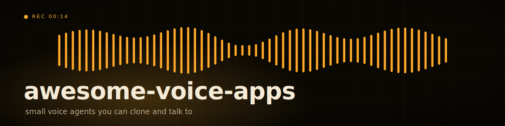

# awesome-voice-apps

Voice agents that answer the phone, take the order, book the slot.
A cookbook of small, self-contained voice AI you can clone and talk to.

<p>
  <a href="https://github.com/mahimairaja/awesome-voice-apps/actions/workflows/lint.yml"></a>
  <a href="https://github.com/mahimairaja/awesome-voice-apps/actions/workflows/test.yml"></a>
  <a href="https://www.python.org"></a>
  <a href="https://docs.livekit.io/agents">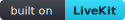</a>
  <a href="https://docs.astral.sh/ruff">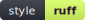</a>
  <a href="https://pre-commit.com"></a>
  <a href="LICENSE"></a>
</p>

[playground](https://playground.mahimai.ca) · [contribute](CONTRIBUTING.md) · [license](LICENSE)

</div>

> **You:** A 12oz iced latte, oat milk, light ice.
> **Agent:** Got it. Anything else, or should I total it?
> **You:** Add a chocolate croissant.
> **Agent:** One iced latte, light ice, oat milk; one chocolate croissant. That is $9.40. What name should I put on it?

Each folder under [`demos/`](demos/) is one voice agent: a few hundred lines of Python on [LiveKit Agents](https://docs.livekit.io/agents), Deepgram for hearing, an LLM for thinking, Cartesia for speaking. Swap any provider in a line. Run one locally, then talk to it in your browser at [playground.mahimai.ca](https://playground.mahimai.ca).

## How a voice agent works

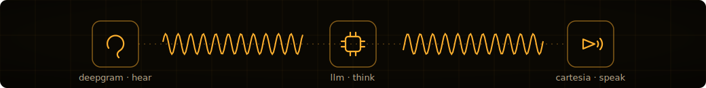

Three providers in a loop: Deepgram hears, an LLM decides, Cartesia speaks. Each demo is that loop plus a few `@function_tool`s. Swap any provider in a line.

## Run one

```sh
git clone https://github.com/mahimairaja/awesome-voice-apps.git
cd awesome-voice-apps/templates/livekit-base
cp .env.example .env
uv sync
uv run python agent.py download-files
uv run python agent.py dev
```

Open the demo at [playground.mahimai.ca/demos](https://playground.mahimai.ca/demos), paste your three LiveKit values, and start the call. [`templates/livekit-base/`](templates/livekit-base/) is the starter every demo copies from: change the instructions, add a `@function_tool`, ship.

## The demos

<!-- gallery:start -->
<table>
<tr>
<td width="50%"><a href="demos/clinic-scheduler/">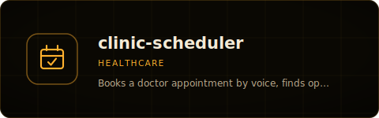</a></td>
<td width="50%"><a href="demos/drive-thru-coffee/">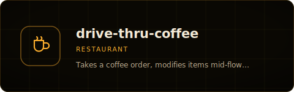</a></td>
</tr>
<tr>
<td width="50%"><a href="demos/front-desk-interpreter/">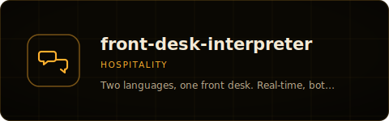</a></td>
<td width="50%"><a href="demos/quick-trivia/">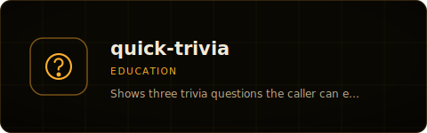</a></td>
</tr>
<tr>
<td width="50%"><a href="demos/roadside-dispatch/">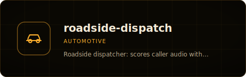</a></td>
<td width="50%"><a href="demos/tenant-rights/">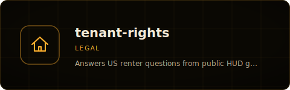</a></td>
</tr>
<tr>
<td width="50%"><a href="demos/water-tracker/">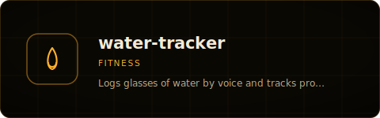</a></td>
<td width="50%"></td>
</tr>
</table>
<!-- gallery:end -->

Every demo is tagged with the one industry it serves: healthcare, legal, finance, realestate, hospitality, restaurant, automotive, education, retail, recruiting, construction, travel, fitness, beauty, logistics, insurance, nonprofit, gov, media. Per-demo metadata lives in [`catalog.json`](catalog.json).

## Tech stack

| Layer | Choice |
| --- | --- |
| Language | Python 3.11 (`uv`) |
| Voice runtime | LiveKit Agents 1.x |
| Default STT / LLM / TTS | Deepgram Nova-3 / OpenAI gpt-4o-mini / Cartesia Sonic-2 |
| VAD / turn detection | Silero / LiveKit MultilingualModel |
| Lint / format | ruff |
| Quality gates | pre-commit, pytest evals (LiveKit judges) |

## Add one

A demo is a folder under `demos/<slug>/`: an `agent.py`, a `pyproject.toml`, a short README, and a `playground.json` when it draws UI. Keep it under 300 lines on top of the template. The day-to-day flow is a single GitHub issue (slug, hook, stack), and a build agent scaffolds the rest. Details in [CONTRIBUTING.md](CONTRIBUTING.md).

## License

[Apache 2.0](LICENSE). Fork it, ship it, sell it.

Built by [Mahimai Raja](https://mahimai.dev) at [Mahimai AI](https://mahimai.ca).
