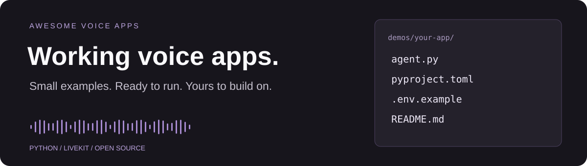

<p align="center"></p>

Small, self-contained voice AI examples. Clone one, run it, make it yours.
Built with Python and LiveKit Agents.

[Examples](#examples) · [Contribute](CONTRIBUTING.md) · [Mahimai](https://mahimai.ca) · [Apache 2.0](LICENSE)

## Run an example

Install [uv](https://docs.astral.sh/uv/), then:

```sh
git clone https://github.com/mahimairaja/awesome-voice-apps.git
cd awesome-voice-apps/demos/drive-thru-coffee
cp .env.example .env
# Fill in .env with your own provider and LiveKit credentials.
uv sync
uv run python agent.py download-files
uv run python agent.py console
```

Console mode uses your microphone and speakers. For a LiveKit room, run
`uv run python agent.py dev` and connect a compatible client. Each example's
README lists its requirements and any extra setup. Provider usage may cost money.


## Examples

| Example | What it does |
| --- | --- |
| [Claim intake](demos/claim-intake/) | Takes an auto insurance claim by voice, validates each field, and files it. |
| [Clinic scheduler](demos/clinic-scheduler/) | Books a doctor appointment by voice, finds open slots, and handles reschedules. |
| [Drive-thru coffee](demos/drive-thru-coffee/) | Takes a coffee order, modifies items mid-flow, totals the cart. |
| [Front desk interpreter](demos/front-desk-interpreter/) | Two languages, one front desk. Real-time, both directions. |
| [Panel scribe](demos/panel-scribe/) | Labels each interviewer's voice live in a candidate debrief and turns it into an attributed scorecard. |
| [Post-op check-in](demos/postop-checkin/) | Calls a patient on day 3 after knee surgery; a fixed rule table, not the model, decides when to send them to the nurse or 911. |
| [Quick trivia](demos/quick-trivia/) | Shows three trivia questions the caller can edit, then quizzes them one at a time and keeps score. |
| [Roadside dispatch](demos/roadside-dispatch/) | Roadside dispatcher: scores caller audio with Tyto, adapts when the line degrades, and re-confirms details captured over a bad line. |
| [Talk to our team](demos/talk-to-our-team/) | GPT-Live sales conversation with request corrections and a guarded simulated calendar. |
| [Tenant rights](demos/tenant-rights/) | Answers US renter questions from public HUD guidance, names the source, and redirects to legal help when a question is out of scope. |
| [Water tracker](demos/water-tracker/) | Logs glasses of water by voice and tracks progress toward a daily goal. |

## Add yours

Copy [`templates/livekit-base`](templates/livekit-base/), build your agent,
and open a PR. Four essentials:

```text
agent.py   pyproject.toml   .env.example   README.md
```

A short reference README is enough. No blog, tutorial, UI manifest, or artwork
required. We write the website content separately. [Contribution steps](CONTRIBUTING.md).

Maintained by [Mahimai Raja](https://github.com/mahimairaja) at [Mahimai](https://mahimai.ca).
